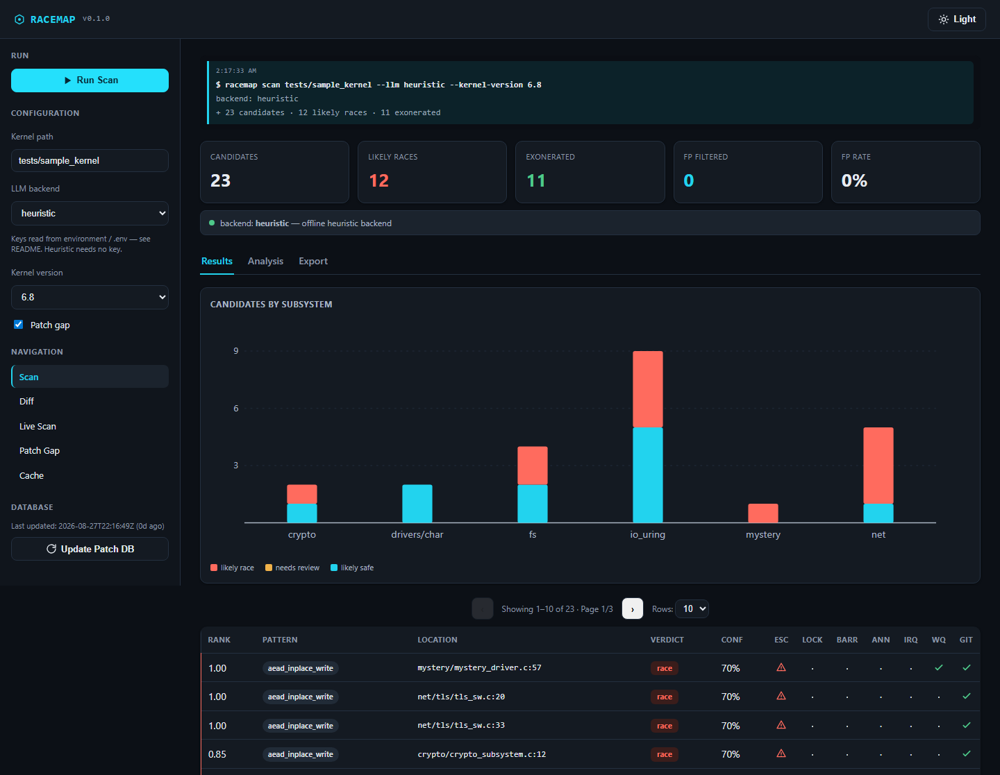
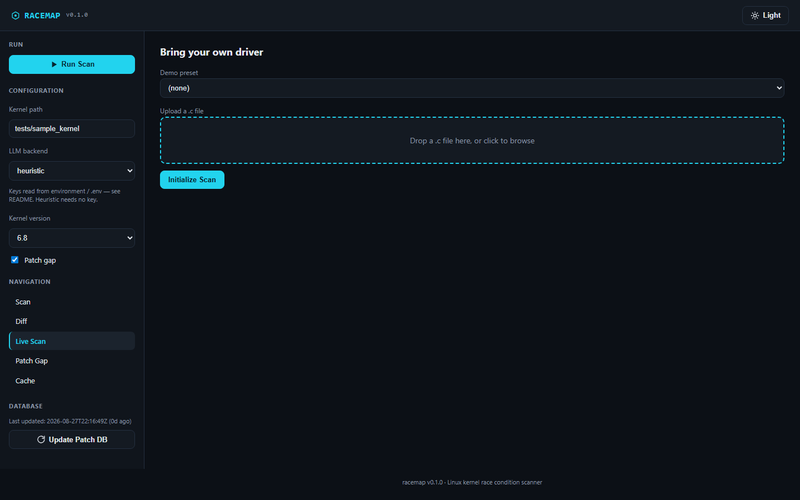

# racemap

**A Linux kernel race-condition scanner with deterministic LLM triage.**

racemap scans Linux kernel source for shared page-cache and zero-copy
asynchronous patterns that can race. Static analysis does the finding: it
surfaces candidate sites where shared state is handed to a deferred operation
without a copy or ownership transfer. A deterministic LLM layer then acts
strictly as a **triage filter** — it does not find bugs, it only reduces false
positives by judging whether each candidate is already adequately protected.



*A scan of the bundled `tests/sample_kernel` fixtures — 23 candidates, 12
likely races, 11 exonerated, matching the figures throughout this README.
Because the target is one of the two bundled demo trees, a few identifiers
are shown under generic aliases (`crypto_subsystem` instead of
`algif_skcipher`, here); see [Web UI](#web-ui) for why, and note that a scan
of a real kernel tree always shows the real identifiers.*

## How it works

racemap is two layers:

**1. Static candidate detection.** A built-in pattern matcher scans the target
subsystems for shared page-cache and zero-copy async handoff patterns. This
layer is responsible for recall — it casts a wide net and produces candidates.
It needs no external toolchain, so results are identical in Docker and on a
developer box, and every figure in this README comes from it.

The same patterns also ship as Coccinelle semantic patches and Semgrep rules
under `rules/`. Pass `--external-tools` to run those instead; racemap warns and
falls back to the built-in matcher if neither `spatch` nor `semgrep` is on PATH.
Expect *fewer* candidates from that path — on the bundled sample tree the
published rules report 8 sites against the built-in matcher's 23 — because the
rule files encode only the vulnerable shapes, while the built-in matcher also
surfaces the guarded variants so the triage layer has something to exonerate.
Both paths feed the same triage and enrichment stages.

**2. Deterministic triage.** Each candidate is triaged by a pluggable backend
(Ollama, Anthropic, OpenAI, or Gemini, with an offline heuristic fallback that
makes runs fully reproducible). The triage layer reduces false positives by
reasoning over locking and ownership sufficiency: caller-lock traversal, Sparse
annotations, memory barriers, interrupt-context detection, and workqueue
detection. It classifies each candidate as *likely race*, *likely safe*, or
*needs review* — it never generates exploit code.

## Features

- Multi-backend triage: Ollama / Anthropic / OpenAI / Gemini, with a
  deterministic offline heuristic fallback
- Export to SARIF 2.1.0, JSON, and CSV
- Diff mode — compare findings between two kernel trees (new / resolved /
  persistent)
- Patch-gap analysis — flag candidates whose known upstream fix is absent
- Git-log cross-reference for recently-modified hot spots
- Per-candidate confidence bands (a fixed width per verdict path, narrowing as
  an LLM backend emits more reasoning steps — not a calibrated statistical
  interval)
- SQLite response cache for fast, repeatable runs
- Interactive call-graph visualization in the web UI
- Live "bring your own driver" scan — paste or upload a single `.c` file



## Install

**Docker:**

```bash
docker build -t racemap .
docker run --rm racemap scan <path>

# Web UI (overrides the CLI entrypoint, maps the Flask port; RACEMAP_HOST is
# required — binding to the default 127.0.0.1 inside the container would be
# unreachable from the host despite the port mapping. -p 127.0.0.1:5005:5005
# keeps the exposure to the host's own loopback: the web UI has no
# authentication and accepts absolute filesystem paths to scan, so it
# should not be reachable from anything other than localhost)
docker run --rm -p 127.0.0.1:5005:5005 -e RACEMAP_HOST=0.0.0.0 --entrypoint python racemap web/server.py
# open http://127.0.0.1:5005
```

**pip:**

```bash
pip install -r requirements.txt
python main.py scan <path>
```

## Configuration

racemap runs fully offline with the default `heuristic` backend — no API key
required, and runs are deterministic.

To use an LLM triage backend, set the matching environment variable (or put it
in a `.env` file in the project root):

| Backend | Variable |
|---------|----------|
| OpenAI | `OPENAI_API_KEY` |
| Anthropic | `ANTHROPIC_API_KEY` |
| Gemini | `GEMINI_API_KEY` |

Ollama needs no key — it talks to a local Ollama server.

If a selected backend's key is unset (or the backend is otherwise unavailable),
racemap automatically falls back to the offline `heuristic` backend and reports
the effective backend in its output, so a run never fails for a missing key.

`.env` is gitignored, so keys are never committed.

## Usage

```bash
# Scan a kernel tree or a single file (offline heuristic backend)
python main.py scan /path/to/linux --llm heuristic

# Scope to specific subsystems
python main.py scan /path/to/linux --subsystem net --subsystem crypto

# Compare two kernel trees
python main.py diff --old /path/to/linux-6.7 --new /path/to/linux-6.8

# Run the self-contained ground-truth validation
python main.py validate

# Run the shipped Coccinelle / Semgrep rules instead of the built-in matcher
# (needs spatch and/or semgrep on PATH; the Docker image has both)
python main.py scan /path/to/linux --external-tools

# Export results as SARIF 2.1.0 (written to results/scan.sarif)
python main.py scan /path/to/linux --output sarif
```

Run `python main.py --help` (or `<command> --help`) for the full option list.

## Web UI

racemap ships a Flask web UI (the one shown in the demo video) alongside the
CLI — Scan, Diff, Live "bring your own driver" scan, Patch Gap, and Cache
views, plus an interactive per-candidate call-graph.

```bash
python web/server.py
# open http://127.0.0.1:5005
```

Note: when the scanned target is one of the bundled demo fixtures
(`tests/sample_kernel` or `tests/ground_truth`), the web UI displays a few
identifiers under generic aliases for the on-screen demo (e.g. `ctx->iv` shows
as `ctx->shared_buf`, `algif_skcipher` shows as `crypto_subsystem`). This is a
display-only substitution in `web/server.py`; it never touches the underlying
detector, the CLI, or a scan of a real kernel tree — those always show the
real identifiers, as named in the [Disclosure](#disclosure) section below.
The JSON / CSV / SARIF exports are likewise always verbatim: the aliasing is
view-only, so a downloaded report never matches the on-screen labels for these
two fixtures.

An alternate Streamlit dashboard (`src/ui/app.py`, not used in the demo video)
is also included: `streamlit run src/ui/app.py`.

## Validation

Two separate things are measured here; the numbers below come from different
commands and it is worth keeping them apart.

**The ground-truth suite** lives in `tests/ground_truth/` and covers 19 of
the 20 Coccinelle rules under `rules/coccinelle/`, declared across
`expected.json` (the algif_skcipher disclosure plus 7 more rules with a
built-in-matcher fallback — 8 total — so these run in the default hermetic
`pytest` pass with no kernel toolchain needed) and
`tests/test_coccinelle_only_rules.py` (11 rules with no fallback — these
need `spatch` on `PATH` and skip otherwise, see the v2.7 CHANGELOG entry for
why CI now installs it). The 20th rule, `io_uring_race`, is deliberately
excluded from the ground-truth suite: it overlaps another rule's pattern
closely enough that the two are ambiguous on some inputs, so it falls
through to no verdict rather than a guess (see the v2.6 CHANGELOG entry) and
isn't independently measured here.

- the reported algif_skcipher race (**CVE-2026-74578**, see
  [Disclosure](#disclosure));
- four zero-copy attack-surface patterns (A–D);
- Dirty Pipe (**CVE-2022-0847**), a `copy_from_user`-under-`mmap_read_lock`
  VMA-stability bug (**CVE-2022-2590**), and the ESP in-place-decryption bug
  Dirty Frag (**CVE-2026-43284**);
- a Bluetooth `hci_conn` deferred-work UAF (fixed upstream commit
  `42de40abe25d`, no CVE assigned at time of writing);
- ten rules each derived from a real 2026 upstream fix — a `net/packet`
  mmap'd-`vnet_hdr` TOCTOU (**CVE-2026-31700**), a non-atomic
  check-then-decrement race (**CVE-2026-43121**), an RCU bare-refcount
  reader race (**CVE-2026-63918**), an RCU list-removal/`call_rcu` mismatch
  (**CVE-2026-46324** shape, nf_tables), a stale-iterator double-put on an
  `xarray` (**CVE-2026-46316**, KVM vgic-its), an f2fs linked-inode UAF
  (**CVE-2026-63816**), a generic DMA/shared-memory double-fetch
  (**CVE-2026-64034** shape), a timer-teardown-before-free ordering bug
  (**CVE-2026-23281** shape), an IRQ-teardown-before-free ordering bug
  (**CVE-2026-43426** shape), and a kthread self-termination UAF
  (**CVE-2026-46180** shape). "Shape" rules generalize the real fix's
  pattern rather than reproducing that exact call site, so they are
  validated against a synthetic fixture built to the same shape, not
  against the original vulnerable file — see each rule's own header comment
  in `rules/coccinelle/` for the specific fix commit it was derived from.

Each carries a vulnerable and a fixed variant, and the scanner must flag the
former and exonerate the latter. Run it with:

```bash
pytest tests/test_ground_truth.py tests/test_coccinelle_only_rules.py
```

(the second file needs `spatch` on `PATH` and skips otherwise — see above).

`python main.py validate` is the CLI shortcut for the algif pair only — it is
the fixture tied to the disclosure below, not the whole suite.

**The sample-tree scan** is a demo over `tests/sample_kernel/`, a different set
of fixtures. It surfaces 12 likely races across 23 candidates, and 0% of the
candidates carrying a mitigation are misclassified as races (11 mitigated sites,
0 wrong) — that is the false-positive rate quoted elsewhere, measured against
the fixtures' own mitigation annotations rather than against `expected.json`:

```bash
python main.py clear-cache && python main.py scan tests/sample_kernel --llm heuristic
```

## Disclosure

racemap's ground-truth set includes a real async-request IV race in
`crypto/algif_skcipher.c`, discovered and reported to security@kernel.org
under coordinated disclosure (2026-06-07) by this project's author,
**Muhammet Kaan KILINÇ**, who also authored the fix. The stable maintainers
accepted the series on 2026-07-17, queuing it for 7.1.y, 6.18.y, 6.12.y,
6.6.y, 6.1.y, 5.15.y, and 5.10.y. **Assigned CVE-2026-74578** (CVSS 3.1: 7.1
HIGH). Note: the CVE record's own description text does not name the
reporter directly (standard for these records); attribution lives in the
merged commit's `Reported-by`/`Signed-off-by` trailers instead, not in the
CVE text itself. Mainline itself was never affected by this specific CVE —
AIO-on-sockets had already been removed there for unrelated reasons (commit
`fcc77d33a34c`), which the CVE record cites as reaching the same end state;
that removal was too invasive to backport to stable as-is, hence the
narrower fix here. The merged stable fix is public:
https://git.kernel.org/pub/scm/linux/kernel/git/stable/linux.git/commit/?id=b05defc41b27c7d0c05c45f67bf5b91c28f93669

No proof-of-concept or exploit code is included in this repository; the
working PoC stays unpublished, per the commitment made in the patch cover
letter.

## License

MIT — see [LICENSE](LICENSE).
